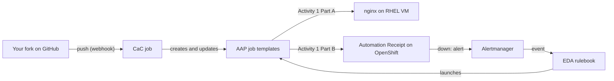

# AAP Workshop

A hands-on workshop for Red Hat Ansible Automation Platform (AAP). Each topic is a short talk followed by an activity, and the activities build on each other toward one small app that is deployed, managed as code, and repairs itself.

## The three activities

| | Activity | What you do |
|---|---|---|
| 1 | [AAP basics](activities/activity01/) | Deploy nginx on your own RHEL VM (Part A) and the "Automation Receipt" web page on OpenShift (Part B), building every AAP object by hand. |
| 2 | [Configuration as Code](activities/activity02/) | Describe those AAP objects in your fork on GitHub. Every push updates AAP through a webhook. |
| 3 | [Event-Driven Ansible](activities/activity03/) | When your web page goes down, an alert reaches EDA and a rulebook launches the job that brings it back. |

## How it fits together

The Automation Receipt shows your progress: each activity you finish lights up on the page.

## Repository layout

| Folder | Contents |
|---|---|
| `activities/` | One folder per activity, each with its playbooks and a step-by-step README for participants |
| `extensions/eda/rulebooks/` | The Activity 3 rulebook (EDA only finds rulebooks here) |
| `terraform/` | Creates the participants' RHEL VMs on AWS |
| `lab/` | Instructor script that creates the participant users, namespaces and permissions |
| `openshift/` | Cluster setup for the instructor, such as console logins |
| `CaC/` | Instructor test that creates every workshop object at once |
| `Execution-environment/` | Optional custom execution environment (not needed by the activities) |

## For participants

Start with [Activity 1, Part A](activities/activity01/webapp-vm/README.md). Your instructor gives you your username, VM address and OpenShift namespace.
